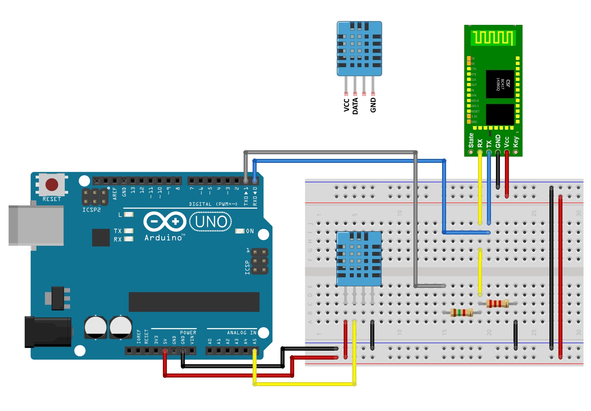
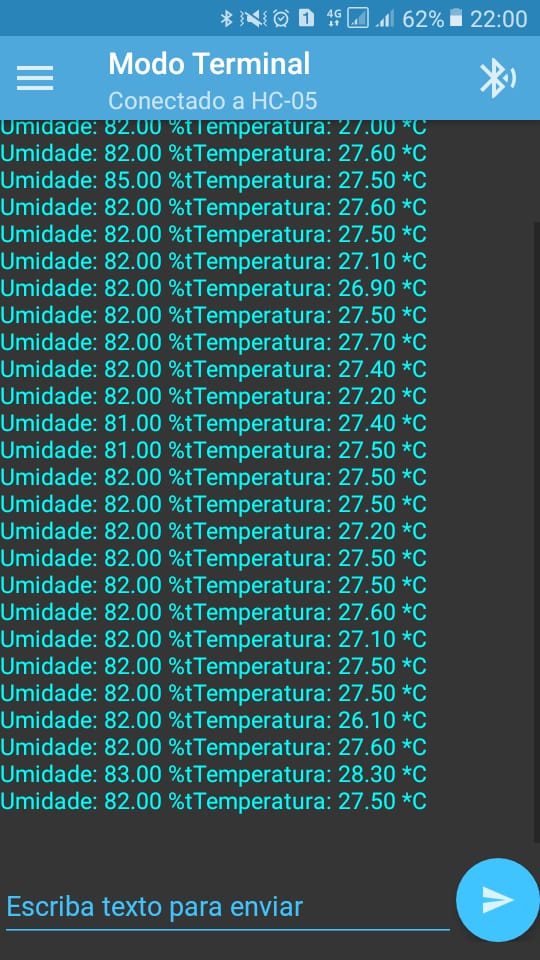

# Estação - Arduino

> Responsável pela entrega: Elisa Rodrigues

- [Repositório do projeto da estação](https://github.com/TeleDevs/SMQG-Station)

## Requisitos da estação

- A estação deve ser um protótipo de baixo custo para coletar dados de temperatura e umidade do ambiente, enviando os dados para o gateway a partir de uma conexão Bluetooth. Além da coleta do ambiente, esta estação deve enviar um número indentificador (ID) para que seja vinculado a região no gateway e também enviar a data das coletas. 
- Para que seja efetuada as coletas de temperatura e umidade é utilizado neste protótipo o Sensor de Umidade e Temperatura DHT11
- Para que seja estabelecida a comunicação entre estação-gateway e sejam enviados os dados coletados pelo sesor DTH11 é utilizado o módulo Bluetooth HC-05
- Para a integração, é utilizada a placa Arduino Nano, para redução de custo e de dimensão.

## Diagrama e Montagem

- Para poder integrar os dispositivos listados dos requisitos do projeto, foi seguido o  tutorial abaixo:

- [Tutorial Módulo Bluetooth com Arduino](https://www.filipeflop.com/blog/tutorial-modulo-bluetooth-com-arduino/)

### Diagrama do projeto:

Esquema para montagem do circuito. Demonstra as pinagens tanto do módulo Bluetooth HC-05 quanto do sensor de umidade e temperatura DHT11.

### Montagem realizada:

Montagem da placa utilizando o Arduino Nano para coleta de temperatura e umidade do ambiente, junto com o módulo HC-05 para comunicação Bluetooth para envios dos dados coletados pelo sensor DTH11 e armazenados na memória EEPROM do arduino. 

### Teste de comunicação:

Para fins de teste da comunicação Bluetooth entre um dispositivo e o arduino foi utilizado o aplicativo 'Bluetooth SPP' disponível gratuitamente na play store. Com a comunicação estabelecida, foi possivel ver o envio dos dados coletados pelo sensor DTH11. Na imagem abaixo, mostra um trecho da comunicação e envio dos dados.

## Armazenamento dos dados

O armazenamentos dos dados coletados é feito pela memória EEPROM do arduino, no qual permite um armazenamento de forma não volátil no mesmo. 
A memória EEPROM do arduino nano tem uma capacidade máxima de 512 bytes, no qual irá limitar a quantidade de dias e dados armazenados no mesmo.
Nesse projeto é possível definir o tempo entre coletas, visando um numero maximo de coletas diárias.
Para exemplo, definimos 4 coletas diárias, e após faze-las é então armazenadas na memória EEPROM do arduino.
Com essa quantidade de coletas diárias, conseguimos armazenar dados de 14 dias na memória.
Caso o número de coleta diárias aumente, a quantidade de dias será reduzida.

Cálculo para quantidade de dias de armazenamento:

*512 bytes / (quantidade de leituras diárias * 9 (quantidade de bytes armazenados por leitura)) = quantidade de dias armazenados*

## Desenvolvimento no código na plataforma Arduino IDE

É possível acessar o código de implementação da estação aqui:
[estação.ino](https://github.com/TeleDevs/SMQG-Docs/blob/main/m3/estacao.ino)

Bibliotecas auxiliares utilizadas:

Para uso do DHT11: [library](https://github.com/adafruit/DHT-sensor-library)

Para definir o Time: [library](https://github.com/PaulStoffregen/Time)

