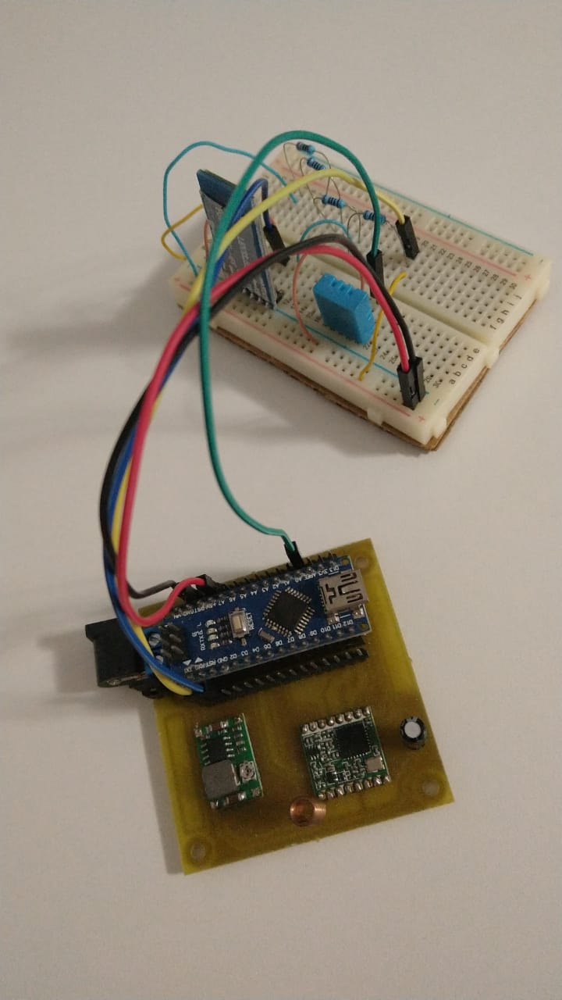

# Estação - Arduino

> Responsável pela entrega: Elisa Rodrigues

- [Repositório do projeto da estação](https://github.com/TeleDevs/SMQG-Station)

## Diagrama e Montagem

- [Tutorial Módulo Bluetooth com Arduino](https://www.filipeflop.com/blog/tutorial-modulo-bluetooth-com-arduino/)

### Diagrama do projeto:

### Montagem realizada:

