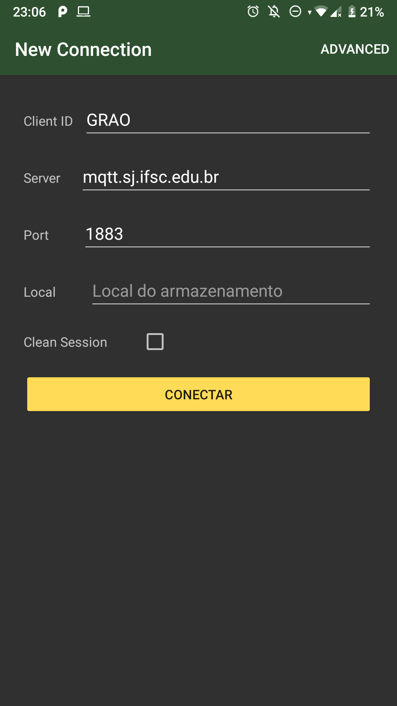
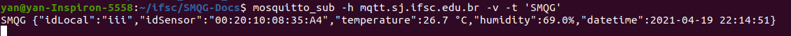

# Gateway - Android

> Responsável pela entrega: Yan Lucas Martins

- [Repositório do projeto do Gateway](https://github.com/TeleDevs/SMQG-Gateway)

O Gateway deste projeto trata-se de um aplicativo para Android. O mesmo comunica-se com a estação de coleta via Bluetooth e envia os valores coletados para um broker MQTT.

A seguir temos algumas capturas de tela do aplicativo desenvolvido:

---

## Início da aplicação

- Tela de carregamento do aplicativo.

---

## Sacas de grãos conectadas

- Exibe uma lista de estações conectadas ao dispositivo Android.
- Nesse caso, `HC-05` é o nome padrão do sensor Bluetooth utilizado neste projeto.
- Deve-se ser selecionada uma das estações para avançar para a tela seguinte.

---

## Cadastro cliente MQTT

- Nesta tela é possível fazer o cadastro de um cliente MQTT onde as coletas da estação serão publicadas.

- O campo `Cliente ID` serve apenas de identificador da sessão dentro do próprio aplicativo.
- O campo `Server` e `Port` referem-se ao endereço do broker MQTT que será acessado.
- O campo `Local` será utilizado como identificador do local da coleta. É o local onde as sacas estão armazenadas.

---

## Aba de coleta de dados do sensor

- Nessa tela são exibidas todas as informações da comunicação Bluetooth.
- Na caixa de texto `Mensagens da comunicação Bluetooth` são exibidos:
    - Em azul: as informações enviadas do Gateway para a Estação;
    - Em verde: as informações recebidas pelo Gateway vindas da Estação;
    - Em amarelo: processos internos de conexão e desconexão da estação.
- O botão `COLETAR ATUAL` solicita a estação uma coleta naquele instante.
- O botão `COLETAR ARMAZENADO` solicita a estação a coleta de todos os valores armazenados.
- Na parte inferior dessa aba é mostrada a última coleta recebida.

---

## Aba de Publish no broker MQTT

- Nesta aba é onde o Gateway irá enviar toda a informação recebida para o broker MQTT.
- Ao pressionar o botão `PUBLISH` todos os dados contidos no dispositivo Android serão enviadas e posteriormente excluídas do dispositivo.

# Histórico de conexões e publish

- Esta aba exibe um histórico de toda a comunicação com o broker MQTT.

# Resultados

O gateway conseguiu se comunicar com a estação e com o broker MQTT com sucesso. Abaixo há uma imagem dos dados recebidos pelo broker MQTT:

