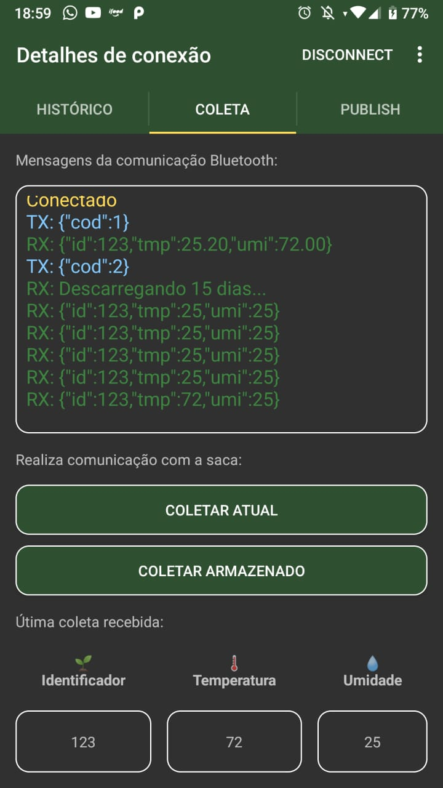
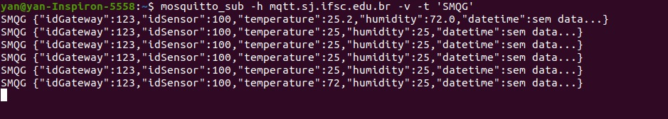

# Validação da proposta

A troca de mensagens foi validada nos seguintes sentidos:

##  Estação-Gateway (Bluetooth)

- Estação e Gateway foram capazes de estabelecer uma comunicação Bluetooth.
- A imagem abaixo exibe a informação trocada.

## Gateway-Broker MQTT

- Gateway foi capaz publicar informações no tópico `SMQG`.
- A imagem abaixo exibe a informação publicada que estava sendo lida em um terminal com o  modo `SUBSCRIBE` ativo.

