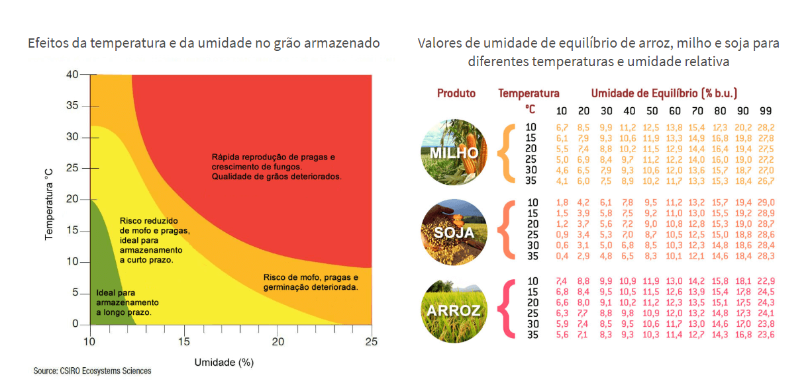
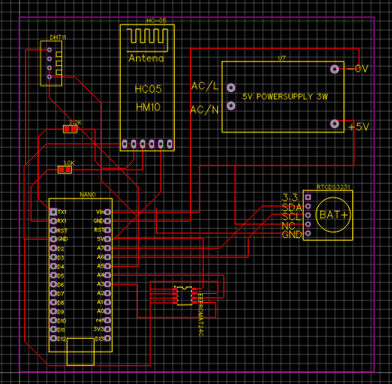
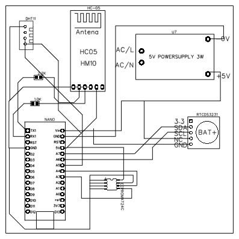
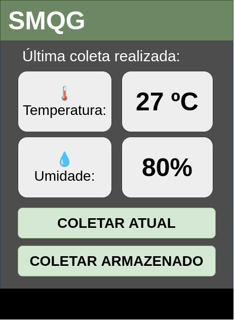

# Produto final

Este documento busca destacar algumas mudanças que devem ser feitas no projeto para que o produto aqui desenvolvido possa ser melhorado a fim de poder ir para o mercado.

## Estudo de mercado

Em um ambiente climatizado a temperatura e umidade são controladas para favorecer o armazenamento de sementes. É essencial entender a importância da umidade e temperatura para encontrar lugares melhores para a armazenagem.

Como nem todos possuem condições para manter um ambiente climatizado, o dispositivo desenvolvido nesse trabalho é útil pelo fato de dar uma garantia a unidade de armazenamento de que a semente foi armazenada de maneira segura.

A imagem abaixo exibe o cenário ideal para alguns grãos:

**Fontes:**

- [Como fazer o armazenamento de sementes de soja e assegurar a germinação](https://blog.aegro.com.br/armazenamento-de-sementes/)
- [Grãos: armazenamento de milho, soja, feijão e café](https://www.cnabrasil.org.br/assets/arquivos/216-ARMAZENAMNTOS-GR%C3%83OS.pdf)

##  Hardware 

A estação projetada neste trabalho utilizou componentes e placas de desenvolvimento mais didáticas para a criar a solução. A utilização do arduino nano traz algumas limitações, principalmente de capacidade de armazenamento para os dados coletados pelo sensor.
Uma solução para esse problema é utilizar chips extras na placa, como por exemplo o módulo de memória EEPROM At24c256, com uma capacidade de 32k bytes permitindo o armazenamento de muito mais dados coletados.

Para poupar a vida útil das baterias que irão alimentação a estação, foi proposto nesse projeto a inserção do módulo RTC DS3231. Além de prover a data real para o Arduino na gravação dos dados coletados, ele também consegue enviar comandos para que o arduino ligue somente em determinados horários no qual deve efetuar uma nova coleta com seu sensor. Isso irá dar um tempo de vida maior para as baterias responsáveis pela alimentação da estação.

### PCB 

Foi utilizado o Easy EDA para projetar o PCB da estação. Após impressão da placa, a mesma será colocada dentro de uma case de acrílico a fim de garantir que os componente fiquem protegidos:

### Orçamento do produto final

Baseado neste PCB proposto, foi realizado o seguinte orçamento final:

|Produto|Quantidade|Preço |Referência|
|-|-:|-|-|
|Arduino Nano|1|R$ 42,90|[referência](https://www.filipeflop.com/produto/placa-nano-v3-0-cabo-usb-para-arduino/?gclid=Cj0KCQjw38-DBhDpARIsADJ3kjlqXp3ARRcfr595k-ywmX_MwTQX5aLIm_ewszfbIw3S4dQ8PgWEwNUaAk6YEALw_wcB)
|Case de acrílico|1|R$ 16,00 |[referênia](https://www.baudaeletronica.com.br/case-para-arduino-uno-de-acrilico-desmontavel.html?gclid=Cj0KCQjw4ImEBhDFARIsAGOTMj8RoeFP2y2MuDmHhDiBaNcFYmeGYdMQy_g823Uwlf9p66arx0G-nqUaAmFNEALw_wcB)
|Módulo Bluetooth RS232 HC-05|1|R$ 48,90|[referência](https://www.filipeflop.com/produto/modulo-bluetooth-rs232-hc-05/)|
|Módulo Memória Eeprom At24c256|1| R$ 16,30 | [referência](https://produto.mercadolivre.com.br/MLB-1480383641-modulo-memoria-eprom-eeprom-at24c256-i2c-arduino-_JM?matt_tool=87716990&matt_word=&matt_source=google&matt_campaign_id=12413740998&matt_ad_group_id=119070072438&matt_match_type=&matt_network=g&matt_device=c&matt_creative=500702333978&matt_keyword=&matt_ad_position=&matt_ad_type=pla&matt_merchant_id=272493441&matt_product_id=MLB1480383641&matt_product_partition_id=337120033364&matt_target_id=pla-337120033364&gclid=Cj0KCQjw4ImEBhDFARIsAGOTMj8WENkZ4XOE2CeYgth4-w1E-_9E8_1K9pAbRPtTNPLnWKB-5tYacxEaAhxTEALw_wcB)|
| Sensor de temperatura e umidade DHT11 | 1 | R$ 10,00 | [referência](https://www.curtocircuito.com.br/sensor-temperatura-dht11.html)|
|Real Time Clock RTC DS3231|1|R$ 21,90 | [referência](https://www.filipeflop.com/produto/real-time-clock-rtc-ds3231/?gclid=Cj0KCQjw4ImEBhDFARIsAGOTMj_Iuc8fcj1RYreMNb6B41Ht_IbCSzjho7qCt2-7hCQnl2gC8WsvTdAaArQZEALw_wcB)

**Total:** R$ 156,00

O valor total deve ser menor, pois os valores dos componentes referenciados são equivalentes aos preços para um cliente comum. Realizando o orçamento com alguma empresa de eletrônicos, esse valor tende a diminuir.

## Software

A interface do aplicativo Android desenvolvido nesse projeto, teve o intuito de abordar uma área mais técnica. Exibindo dados da comunicação Bluetooth e com o Broker MQTT. Esse tipo de interface, pode não ser tão intuitiva para um usuário final.

Nesse cenário, para coletar e publicar as coletas o usuário deve seguir o seguinte procedimento:

1. Abrir o aplicativo;
2. Selecionar a saca de grãos;
3. Inserir o broker MQTT;
4. Digitar local da coleta;
5. Pressionar o botão `Coletar Armazenado` (comunicação entre Arduino e Android);
6. Pressionar o botão `Publish` (envio dos dados para o broker MQTT);

O fluxo proposto a seguir, busca deixar a interface mais simples e intuitiva. Resumindo-se a:

1. Abrir o aplicativo;
2. Selecionar a saca de grãos;
3. Fazer um *login* com usuário e senha;
    - Baseado neste *login*, os dados do Broker MQTT serão carregados;
4. Digitar local da coleta;
5. Pressionar o botão `Coletar Armazenado`
    - Ao pressionar esse botão, todo o processo de coletar os dados da estação e publicar no broker MQTT ocorrerão sem nenhuma outra interferência do usuário.

Abaixo há uma proposta de uma nova tela de usuário. Sem as abas de histórico e publish MQTT e tampouco a exibição dos JSONs trocados durante a comunicação Bluetooth:

